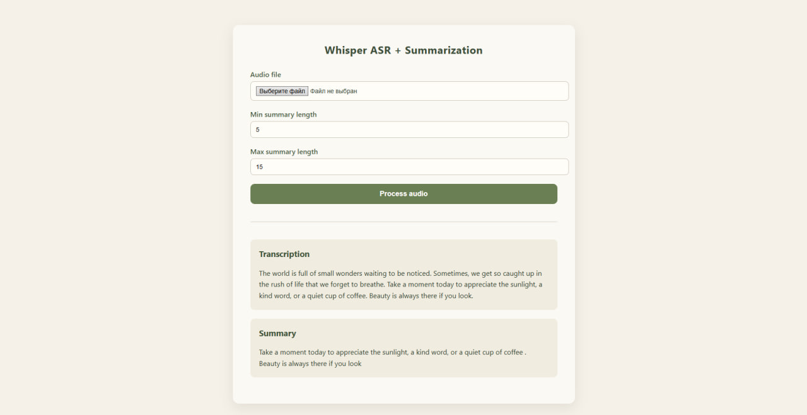

# Whisper ASR + Summarization Web Service

Проект представляет собой **end-to-end ML-сервис** для:
- распознавания речи из аудиофайлов (ASR) (только английский язык)
- автоматической текстовой суммаризации результата

Реализован в виде **двухслойной архитектуры**:
- FastAPI — ML backend (GPU, Whisper, NLP)
- Django — web-интерфейс для пользователя  
с автоматическими тестами и CI (GitHub Actions).

---

## 🔹 Основной функционал

- Загрузка аудиофайлов (`.wav`, `.mp3`, `.flac`)
- Распознавание речи с помощью Whisper (eng)
- Суммаризация текста (настраиваемая длина)
- Web-интерфейс (HTML форма)
- REST API + Swagger UI
- Автоматические тесты (pytest)
- CI-пайплайн при каждом push

---

## 🧠 Используемые технологии

- Python 3.11+
- PyTorch
- HuggingFace Transformers (Whisper, DistilBART)
- FastAPI (ASGI, REST API)
- Django (web UI)
- pytest (тестирование)
- GitHub Actions (CI)
- FFmpeg (аудио-декодирование)

---

## 🚀 Установка и запуск

### 1. Клонирование репозитория

```bash
git clone https://github.com/MrAladawee/Whisper-asr-summarization.git
cd Whisper-asr-summarization
```

### 2. Создание виртуального окружения

```bash
python -m venv .venv
source .venv/bin/activate     # Linux / macOS
.venv\Scripts\activate        # Windows
```

### 3. Установка зависимостей

```bash
pip install -r requirements.txt
```

### 4. Установка FFmpeg (обязательно)

Windows

Скачать бинарники: https://www.gyan.dev/ffmpeg/builds/

Добавить ffmpeg/bin в PATH

Проверить:
```bash
ffmpeg -version
```

### 5. Запуск FastAPI

```bash
uvicorn api.main:app --reload
```

http://127.0.0.1:8000/docs - Swagger UI

### 6. Запуск Django

```
cd web
python manage.py migrate
python manage.py runserver 8001
```

http://127.0.0.1:8001/ - Web-интерфейс



### 7. Проверки

```bash
pytest
```

## 🔄 CI (Continuous Integration)

В проекте настроен GitHub Actions CI:

Запускается при каждом push и pull request

Устанавливает зависимости

Запускает pytest

При падении тестов сборка помечается как failed

Файл CI: .github/workflows/ci.yml
